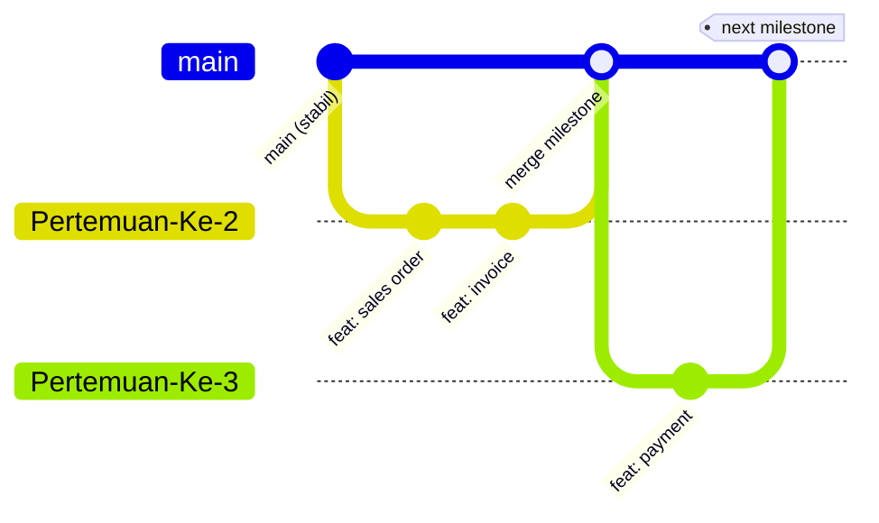

<div align="center">

# 🤝 Contributing — SpillBill

**Panduan Kontribusi untuk Tim Pengembang SpillBill**


</div>

---

Terima kasih sudah mau berkontribusi pada **SpillBill**! 🎉 Dokumen ini berisi aturan main supaya semua orang bisa bekerja rapi, cepat, dan tidak saling menimpa pekerjaan. Baca dulu sebelum mulai — singkat kok. 📖

---

## 📌 Prasyarat

| Kebutuhan | Versi / Keterangan |
|---|---|
| Node.js | **22+** (wajib) |
| Git | Terbaru |
| Akun GitHub | Punya akses ke repo `LazzianT/SpillBill` |
| Editor | VS Code (disarankan, ekstensi ESLint + Prettier) |

---

## 🚀 Setup Environment

```bash
# 1️⃣ Clone repo (frontend & backend — dual repo)
git clone https://github.com/LazzianT/spillbill-frontend.git
git clone https://github.com/LazzianT/spillbill-backend.git

# 2️⃣ Install dependencies
npm install

# 3️⃣ Setup environment variables
cp .env.example .env   # isi Supabase URL & API Key — JANGAN pernah di-commit!

# 4️⃣ Jalankan di lokal
npm run dev
```

---

## 🌿 Alur Branch



| Branch | Fungsi | Aturan |
|---|---|---|
| `main` | Produksi — **selalu stabil** | Hanya menerima merge dari branch milestone |
| `Pertemuan-Ke-N` | Milestone per pertemuan | Tempat kerja harian (commit bebas) |

> 💡 Buat branch baru `Pertemuan-Ke-N` untuk setiap milestone. Selesaikan pekerjaan di sana, lalu merge ke `main` saat milestone selesai.

---

## ✍️ Konvensi Commit Message

Gunakan format **Conventional Commits** supaya riwayat git rapi dan mudah dilacak:

```
<type>: <deskripsi singkat dalam bahasa Indonesia>
```

| Type | Kapan dipakai | Contoh |
|---|---|---|
| `feat` | Fitur baru | `feat: tambah form input sales order dinamis` |
| `fix` | Perbaikan bug | `fix: subtotal tidak terhitung saat qty diubah` |
| `docs` | Dokumentasi | `docs: update README badge dinamis` |
| `style` | Format/UI tanpaubah logika | `style: rapikan spacing halaman invoice` |
| `refactor` | Restrukturisasi kode | `refactor: pisahkan logika kalkulasi ke util` |
| `test` | Menambah/memperbaiki test | `test: tambah test generate nomor invoice` |
| `chore` | Config, dependency, tooling | `chore: upgrade vite ke versi terbaru` |

**Contoh yang baik:**
```
feat: one-click generate invoice dari sales order
fix: status invoice berubah otomatis jadi Paid saat lunas
```

**Contoh yang buruk:** ❌ `update`, ❌ `fix bug`, ❌ `asdfsdf`

---

## 🔄 Workflow Kontribusi

1. **Sinkronkan dulu** — `git pull origin Pertemuan-Ke-N` sebelum mulai kerja
2. **Kerjakan fitur/fix** di branch milestone yang aktif
3. **Commit kecil-kecil** — satu commit = satu perubahan logis
4. **Push** — `git push origin Pertemuan-Ke-N`
5. **Merge ke `main`** hanya jika milestone sudah stabil dan sudah diuji

---

## 🎨 Code Style

- ✅ **TypeScript** untuk frontend — hindari `any` kalau tidak perlu
- ✅ **JavaScript** untuk backend (Express)
- ✅ Nama variabel/fungsi dalam **bahasa Inggris**, komentar boleh bahasa Indonesia
- ✅ Komponen React menggunakan **PascalCase**: `InvoiceTable.tsx`
- ✅ Satu komponen/modul = satu tanggung jawab

---

## 🔒 Keamanan (WAJIB)

| Aturan | Alasan |
|---|---|
| 🚫 **Jangan commit `.env`** | Supabase URL & API Key harus tetap rahasia (`NFR-SEC-01`) |
| 🚫 Jangan hardcode kredensial di kode | Terdeteksi Git = harus rotate semua key |
| ✅ Selalu pakai **parameterized queries** | Pencegahan SQL Injection (`NFR-SEC-02`) |
| ✅ Hormati **role-based access** | Admin Marketing ≠ Admin Accounting (`NFR-SEC-03`) |
| ✅ Data dihapus masuk tabel *history* | Jangan hard-delete permanen (Safety) |

---

## 🧪 Checklist Sebelum Push

- [ ] `npm run dev` jalan tanpa error
- [ ] Fitur yang diubah sudah dites manual di browser
- [ ] Tidak ada `console.log` sisa debugging
- [ ] Tidak ada file `.env` / kredensial yang ter-commit (`git status` dicek!)
- [ ] Commit message sudah sesuai konvensi
- [ ] Business rules terjaga: SO *Invoiced* terkunci 🔒, Invoice *Paid* terkunci 🔒

---

## ❓ Butuh Bantuan?

Diskusikan di grup tim atau tag rekan developer di issue. Jangan sungkan — mending tanya daripada bikin merge conflict! 😄

---

<div align="center">

**Happy Coding!** 🚀 Dibuat dengan ❤️ oleh Tim SpillBill

</div>
