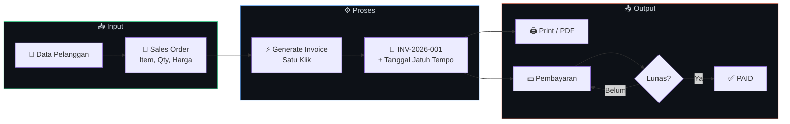

<div align="center">


<a href="https://github.com/LazzianT/SpillBill">
  
</a>


<!-- Badge dinamis — update otomatis dari GitHub API -->


**SpillBill** adalah aplikasi web *Order-to-Invoice* yang membantu UMKM mengelola seluruh alur transaksi — mulai dari pencatatan pelanggan, pemesanan (Sales Order), penerbitan faktur otomatis, hingga pelacakan pembayaran dan pelunasan — semuanya secara digital, cepat, dan rapi.

> 📌 **Status:** Repositori ini saat ini berisi *dokumentasi* (README + SRS). Fitur, role, dan non-functional requirements di bawah adalah **target yang direncanakan** — kode aplikasi belum di-push dan akan menyusul di milestone berikutnya.

</div>

---

## ✨ Fitur Utama

| | Fitur | Deskripsi |
|:---:|---|---|
| 👥 | **Customer Management** | Tambah, ubah, dan lihat detail data pelanggan dengan aman |
| 📝 | **Sales Order Management** | Form pesanan dinamis — tambah/hapus baris item (Nama, Qty, Harga) |
| 🧮 | **Auto Kalkulasi** | Subtotal per item & Grand Total dihitung instan di sisi client (< 100ms) |
| 🧾 | **One-Click Invoice** | Konversi Sales Order → Invoice dengan nomor unik `INV-2026-001` |
| 🖨️ | **Print / Download PDF** | Cetak faktur berformat profesional (Print-Friendly) |
| 💵 | **Payment Tracking** | Catat pembayaran parsial / pelunasan lengkap dengan bukti bayar |
| 📊 | **Dashboard Statistik** | Total omzet, total piutang, dan jumlah invoice *Overdue* |

---

## 🔄 Alur Kerja Sistem



> ⚠️ **Business Rules:** Sales Order tidak dapat diedit/dihapus setelah status *Invoiced* — Invoice tidak dapat diedit/dihapus setelah status *Paid*.

---

## 👤 Role Pengguna

| Role | Tanggung Jawab |
|---|---|
| 📈 **Admin Marketing** | Mengelola data pelanggan & memproses pesanan (Sales Order) |
| 🧾 **Admin Accounting** | Menerbitkan tagihan & mencatat penerimaan pembayaran |

---

## 🛠️ Tech Stack

| Layer | Teknologi |
|---|---|
| **Frontend** | React + Vite + TypeScript |
| **Backend** | Express.js (Node.js 22+) |
| **Database** | Supabase (PostgreSQL) |
| **Hosting** | Vercel |
| **Arsitektur** | Dual Repo (FrontEnd + BackEnd) • Role-Based Access Control |

<details>
<summary><b>🔐 Keamanan & Non-Functional Requirements</b></summary>
<br/>

| ID | Requirement |
|---|---|
| NFR-PERF-01 | Waktu muat halaman < 2 detik |
| NFR-PERF-02 | Kalkulasi subtotal instan (< 100ms) di sisi client |
| NFR-SEC-01 | API Key & Database String disembunyikan via `.env` |
| NFR-SEC-02 | Pencegahan SQL Injection dengan *parameterized queries* |
| NFR-SEC-03 | Role-Based Access Control (RBAC) |
| 🛡️ Safety | Data yang dihapus tidak hilang — masuk ke tabel *history* |

</details>

<details>
<summary><b>📋 Functional Requirements Lengkap</b></summary>
<br/>

**👥 Customer Management**
- `FR-CUST-01` — Admin dapat menambah, mengubah, dan melihat detail data pelanggan
- `FR-CUST-02` — Hapus pelanggan hanya jika belum memiliki riwayat transaksi

**📝 Sales Order Management**
- `FR-ORD-01` — Membuat Sales Order baru dengan pelanggan terdaftar
- `FR-ORD-02` — Penambahan/penghapusan baris item secara dinamis
- `FR-ORD-03` — Kalkulasi otomatis Subtotal & Grand Total

**🧾 Automated Invoice Generation**
- `FR-INV-01` — Konversi Sales Order → Invoice satu klik
- `FR-INV-02` — Nomor Invoice unik + tanggal jatuh tempo
- `FR-INV-03` — Tombol "Cetak / Download PDF" layout faktur resmi

**💵 Payment Tracking & Reporting**
- `FR-PAY-01` — Riwayat pembayaran (Jumlah, Tanggal, Metode, Bukti Bayar)
- `FR-PAY-02` — Status otomatis menjadi *Paid* saat lunas
- `FR-DASH-01` — Statistik omzet, piutang, dan invoice *Overdue*

</details>

---

## 🚀 Memulai

```bash
# 1️⃣ Clone repository (frontend & backend — dual repo)
git clone https://github.com/LazzianT/spillbill-frontend.git
git clone https://github.com/LazzianT/spillbill-backend.git

# 2️⃣ Jalankan — 🔜 menyusul
# Kode aplikasi belum di-push ke repo mana pun. Saat sudah tersedia:
npm install          # Node.js 22+
cp .env.example .env # isi Supabase URL & API Key
npm run dev
```

---

## 👥 Tim Pengembang

<div align="center">

| NPM | Nama | Peran |
|:---:|:---:|:---:|
| **202343501595** | **Syanaia Lulailika** | 🧑‍💻 Developer Module Payment |
| **202343501604** | **Lazzian Al Falah** | 🧑‍💻 Developer Module Invoicing |
| **202343501690** | **Muhammad Izra Ilham** | 🧑‍💻 Developer Module Sales Order |

</div>

---

## 📚 Referensi

- IEEE 29148 — Systems and Software Engineering Requirements
- Sommerville — *Software Engineering*
- Pressman — *Software Engineering: A Practitioner's Approach*
- Template SRS — Karl Wiegers

---

<div align="center">


**SpillBill** — Dibuat dengan ❤️ oleh Tim SpillBill

*⭐ Star repo ini jika bermanfaat!*

</div>
